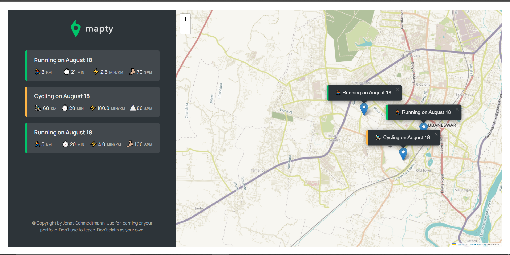

## Table of Contents

- [Overview](#overview)
  - [Features](#features)
  - [Screenshot](#screenshot)
  - [Links](#links)
- [My Process](#my-process)
  - [Built with](#built-with)
  - [What I learned](#what-i-learned)
- [Author]

## Overview

### Features
    - Render form on user click on a particular area of the map.
    - Render marker on map & on list on submitting activities.
    - Show minimal list of activities.
    - Zoom map to the specified place on clicking the list.
    - Load app with previous list & marker on next visit.
  
 ### Screenshot
 
 
 
 ### Links
 
 -  Live site link: [Link here](https://maptyyapp.netlify.app/)
 
 ## My Process
 
 ### Built with
 
 -  Semantic HTML markup
 -  CSS Grid
 -  Mobile first-workflow
 -  Javascript Oop
